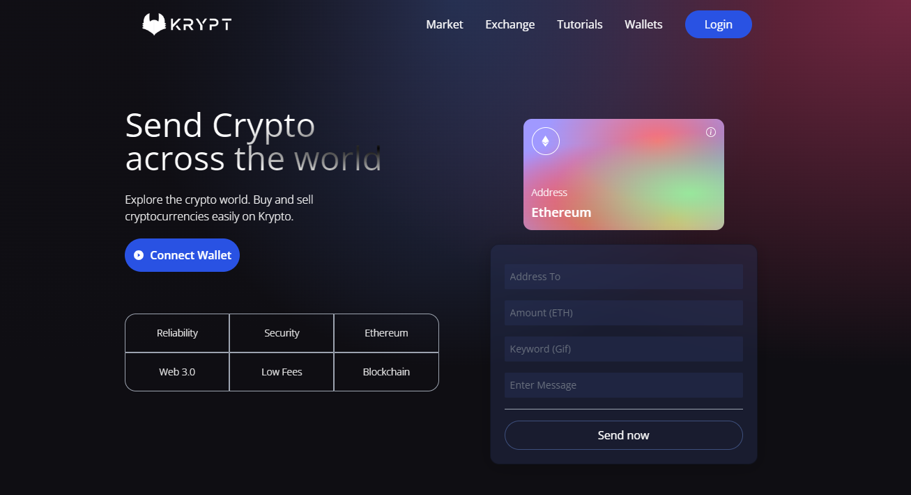

# Krypt - Web 3.0 Blockchain Application



**Table of Contents**

- [Introduction](#introduction)
- [About](#about)
- [Features](#features)
- [Getting Started](#getting-started)
- [Usage](#usage)
- [Technologies Used](#technologies-used)

## Introduction

Web 3.0 has the potential to change the internet as we know it, forever. Krypt is a Web 3.0 blockchain application that demonstrates the power of blockchain technology. This project was created in collaboration with Enyel Sequeira.

This project was inspired by the YouTube tutorial [Watch the Tutorial](https://www.youtube.com/watch?v=Wn_Kb3MR_cU&t=7189s&ab_channel=JavaScriptMastery).

With a stunning design, connected to the blockchain, MetaMask pairing, interaction with smart contracts, sending Ethereum through the blockchain network, writing Solidity code, and much more, Krypt is the best #Web3 #Blockchain app that you can currently find on YouTube and the entire internet.

## About

Krypt is a full-fledged Web 3.0 application that showcases various blockchain features, including connecting to the Ethereum network via MetaMask, writing Solidity smart contracts, and enabling users to send transactions through the blockchain.

## Features

- Stunning UI/UX design
- Integration with the Ethereum blockchain
- MetaMask pairing
- Smart contract development
- Sending Ethereum transactions

## Getting Started

To run this project locally, follow these steps:

1. **Clone this repository**.

2. **Install the necessary dependencies for both the client and smart contract folders**.

```bash
# Install client dependencies
cd client
npm install

# Install smart contract dependencies
cd ../smart_contract
npm install
```

## Usage

Start the client application.
bash

1. **Start the client application:**

   ```bash
   # In the client folder
   npm run dev

   ```

2. \*\*Deploy the smart contract

   ```bash
   # In the smart_contract folder
   npx hardhat run scripts/deploy.js

   ```

3. **Access the application at http://localhost:3000 in your web browser.**

## Technologies Used

- React
- Ethereum
- Solidity
- MetaMask
- Vite
- Tailwind CSS
